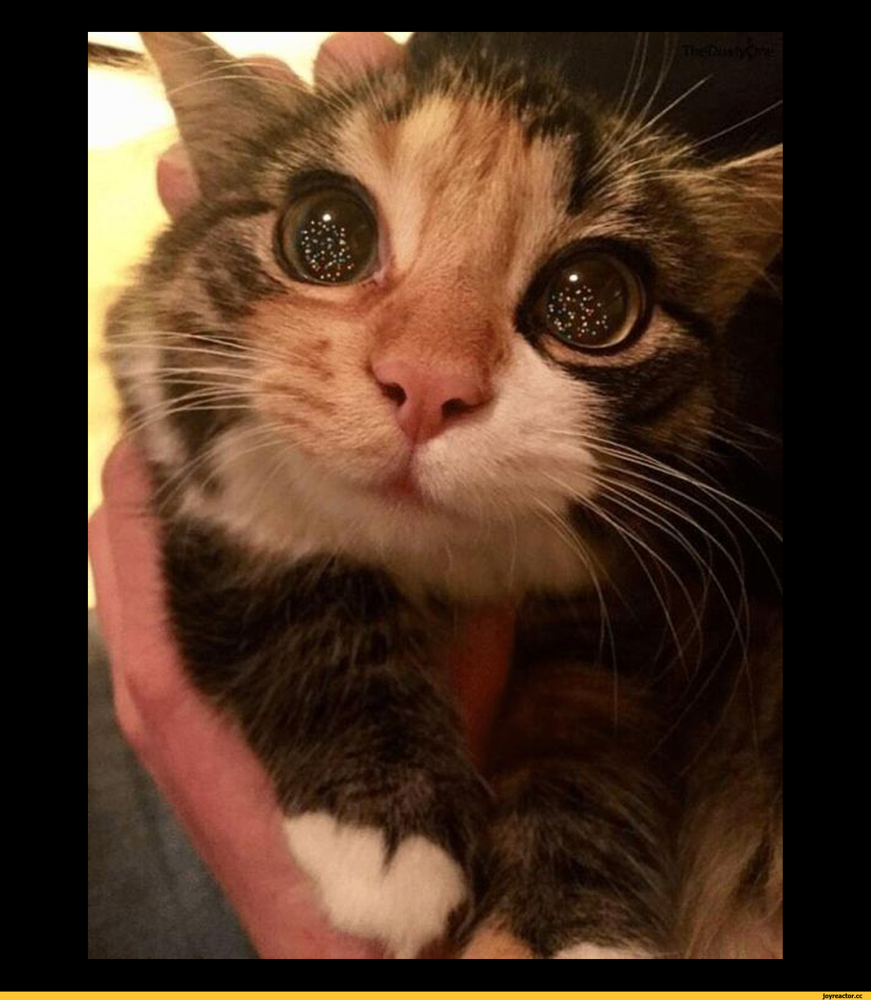

# VisionTag — Auto-label images with Vertex AI & Label Studio

**VisionTag** is an open-source **image labeling** tool powered by **Vertex AI Gemini**. Define your labels in one YAML file, run a single command, and get a `labels.csv` — with optional **Label Studio** review for human-in-the-loop **auto annotation**.

Perfect for **meme datasets**, **reaction labeling**, **computer vision** training data, and any project that needs fast, schema-driven **dataset creation**.



## Features

- **Vertex AI Gemini** vision models — label images with structured JSON output
- **One YAML schema** — drives the AI prompt, CSV columns, and Label Studio UI
- **CSV export** with per-image token usage and **cost tracking**
- **Resume & skip** — re-run anytime; already-labeled images are skipped
- **429 rate-limit handling** — exponential backoff + automatic end-of-run retry passes
- **Label Studio integration** — generate XML config, import JSON with predictions, local file helpers

## Quick start (5 min)

### 1. Install

```bash
cd vision-tag
pip install -e .

# Optional: Label Studio helpers
pip install -e ".[label-studio]"
```

### 2. Configure GCP

Copy `.env.example` to `.env` and set your project:

```bash
cp .env.example .env
```

```env
GOOGLE_CLOUD_PROJECT=your-gcp-project-id
GOOGLE_CLOUD_LOCATION=global
VERTEX_MODEL=gemini-2.5-flash
```

Authenticate:

```bash
gcloud auth application-default login
gcloud config set project your-gcp-project-id
```

### 3. Label the bundled cat example

```bash
visiontag run --limit 1
```

This reads `examples/images/cat_example.jpeg`, calls Gemini, and writes `labels.csv`.

### 4. Label your own folder

```bash
visiontag run --images-dir ./my_images
```

## Customize labels

Edit **`config/label_schema.yaml`** — no Python changes required.

```yaml
name: meme-reactions
description: Label meme reactions for semantic search

image_field: image

fields:
  reactions:
    type: multi_choice
    label: Select all reactions that apply
    choices: [awe, wonder, cute, happy, ...]
  sentiment:
    type: single_choice
    choices: [positive, negative, neutral, mixed]
  meaning:
    type: text
```

Field types: `multi_choice`, `single_choice`, `text`.

See `config/label_schema.minimal.yaml` for a tiny starter schema.

Regenerate Label Studio config after editing:

```bash
visiontag generate-label-studio-config -o label_studio_config.xml
```

## Label Studio (optional)

Full **Option B** pipeline — auto-label, then import into Label Studio for review:

```bash
visiontag pipeline --limit 50
```

Or step by step:

```bash
visiontag run --images-dir ./my_images
visiontag generate-label-studio-config -o label_studio_config.xml
visiontag build-label-studio-import labels.csv -o tasks_with_predictions.json
visiontag fix-local-files
label-studio
```

1. Create a project and paste `label_studio_config.xml` into **Settings → Labeling Interface**
2. Enable **Use predictions to prelabel tasks**
3. Import `tasks_with_predictions.json`
4. Review, fix, and submit each task

See [`label_studio/README.md`](label_studio/README.md) for details.

## CLI reference

| Command | Description |
|---------|-------------|
| `visiontag run` | Label images with Vertex AI |
| `visiontag pipeline` | Run + generate Label Studio config + import JSON |
| `visiontag generate-label-studio-config` | Schema YAML → Label Studio XML |
| `visiontag build-label-studio-import` | CSV → tasks with predictions |
| `visiontag fix-local-files` | Configure Label Studio local file serving |

### `visiontag run` flags

| Flag | Default | Purpose |
|------|---------|---------|
| `--images-dir` | `examples/images/` | Folder of images |
| `--schema` | `config/label_schema.yaml` | Label schema |
| `-o` | `labels.csv` | Output CSV |
| `--limit` | all | Max images |
| `--sleep` | 1.0s | Pause between images |
| `--retry-passes` | 5 | End-of-run retry rounds |
| `--retry-sleep` | 45s | 429 backoff base delay |
| `--retry-attempts` | 4 | API attempts per retry |

## Cost estimate

Each row in `labels.csv` includes `input_tokens`, `output_tokens`, and `estimated_cost_usd`.

Typical cost with **gemini-2.5-flash**: ~$0.0006 per image (~3,600 tokens).

| Images | Est. cost (USD) |
|--------|-----------------|
| 100 | ~$0.06 |
| 1,000 | ~$0.60 |
| 2,000 | ~$1.20 |

Override pricing via env vars: `VERTEX_INPUT_COST_PER_M`, `VERTEX_OUTPUT_COST_PER_M`.

## Handling rate limits (429)

Vertex AI may return **429 Resource exhausted** on large batches. VisionTag handles this automatically:

1. **Per-image backoff** — on 429, waits 45s → 90s → 180s before retrying the same image
2. **End-of-run retry passes** — after the main batch, retries all failures up to 5 times (45s, 90s, 135s, … between passes)
3. **Resume on re-run** — failed rows are not treated as done; run the same command again later

For **2,000+ images**, increase delays:

```bash
visiontag run --images-dir ./big_dataset --sleep 2 --retry-sleep 60
```

Failed images stay in `labels_checkpoint.jsonl` with empty labels or `ERROR:` in notes. Only successful rows appear in `labels.csv`.

## Project layout

```
vision-tag/
├── config/label_schema.yaml    # Edit this to customize labels
├── examples/images/            # Bundled cat example
├── vision_tag/                 # Python package
└── labels.csv                  # Output (gitignored)
```

## Contributing

MIT License — see [LICENSE](LICENSE).

**GitHub topics:** `vertex-ai`, `gemini`, `image-labeling`, `label-studio`, `computer-vision`, `dataset`, `meme`, `auto-annotation`, `python`
